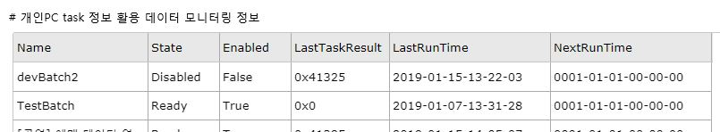
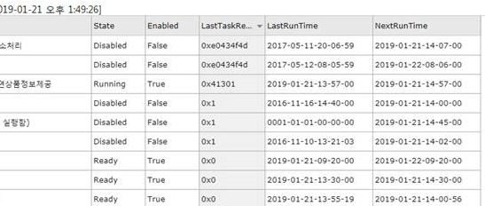
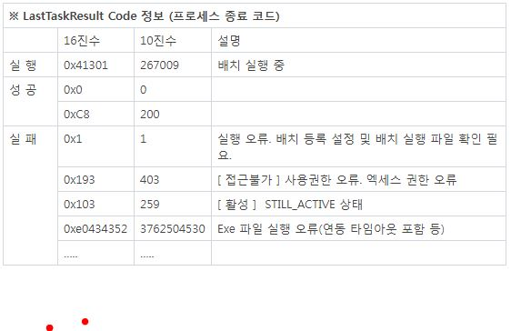

# MonitorTaskScheduler
Windows Server Task Scheduler Monitoring

## 1. 프로젝트 정보 및 버젼

### *[ TaskWebNew Solution ]	
### *[ TaskWebNew.csproj ]	

| 프로젝트 | 설명 | .NET버젼 | TaskWebNew버젼 |
| -------- | -------- | -------- | -------- |
| TaskWebNew | Task Scheduler Monitor	| .NET 4.5	| TaskWebNew 1.0.0.0 |


## 2. TaskWebNew 참조
- using System.Xml.Linq;
- using System.Text.RegularExpressions;
- using Microsoft.Win32.TaskScheduler;


## 3. TaskWebNew 참고 라이브러리
```
# TaskScheduler Library
- https://www.nuget.org/packages/Microsoft.Win32.TaskScheduler/

# TaskService Class
- https://dahall.github.io/TaskScheduler/html/T_Microsoft_Win32_TaskScheduler_TaskService.htm

# TaskService Methods
- https://dahall.github.io/TaskScheduler/html/Methods_T_Microsoft_Win32_TaskScheduler_TaskService.htm

# Task Scheduler Error and Success Constants
- https://docs.microsoft.com/en-us/windows/desktop/taskschd/task-scheduler-error-and-success-constants
```

## 4. TaskList Grid UI 참고 라이브러리
```
# jqgrid UI 
- jqwidgets > jqgrid
- jQWidgets v6.2.0 (2018-Dec)
- https://jqwidgets.com
```

## 5. TaskList 샘플 






